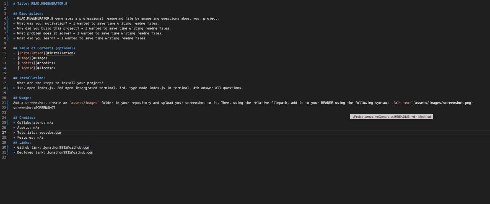

# Title: READ.MEGENERATOR.9

## Discription:
* READ.MEGENERATOR.9 generates a professional readme.md file by answering questions about your project.
- What was your motivation? - I wanted to save time writing readme files.
- Why did you build this project? - I wanted to save time writing readme files.
- What problem does it solve? - I wanted to save time writing readme files.
- What did you learn? - I wanted to save time writing readme files.

## Table of Contents (optional)
- [Installation](#installation)
- [Usage](#usage)
- [Credits](#credits)
- [License](#license)

## Installation:
- What are the steps to install your project?
* 1st. open index.js. 2nd open intergrated terminal. 3rd. type node index.js in terminal. 4th answer all questions.

## Usage:
Add a screenshot, create an `assets/images` folder in your repository and upload your screenshot to it. Then, using the relative filepath, add it to your README using the following syntax: !'[alt text](assets/images/screenshot.png)'
screenshot: 

## Credits:
* Collaborators: n/a
* Assets: n/a
* Tutorials: youtube.com
* Features: n/a
## Links:
* Github link: https://github.com/jonathonvanausdal9915/read.meGenerator.9
* Deployed link: https://jonathonvanausdal9915.github.io/read.meGenerator.9/
* video link: 
