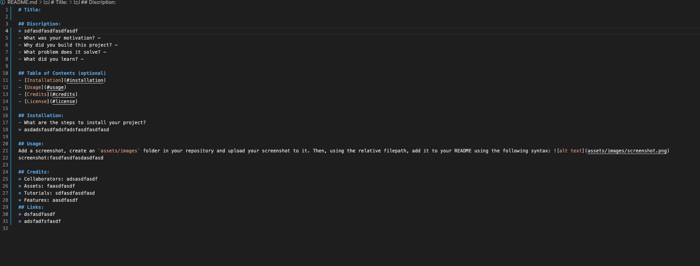

# Title: 

## Discription:
* sdfasdfasdfasdfasdf
- What was your motivation? - 
- Why did you build this project? - 
- What problem does it solve? - 
- What did you learn? - 

## Table of Contents (optional)
- [Installation](#installation)
- [Usage](#usage)
- [Credits](#credits)
- [License](#license)

## Installation:
- What are the steps to install your project?
* asdadsfasdfadsfadsfasdfasdfasd

## Usage:
Add a screenshot, create an `assets/images` folder in your repository and upload your screenshot to it. Then, using the relative filepath, add it to your README using the following syntax: 
screenshot:

## Credits:
* Collaborators: adsasdfasdf
* Assets: faasdfasdf
* Tutorials: sdfasdfasdfasd
* Features: aasdfasdf
## Links:
* dsfasdfasdf
* adsfadfsfasdf
